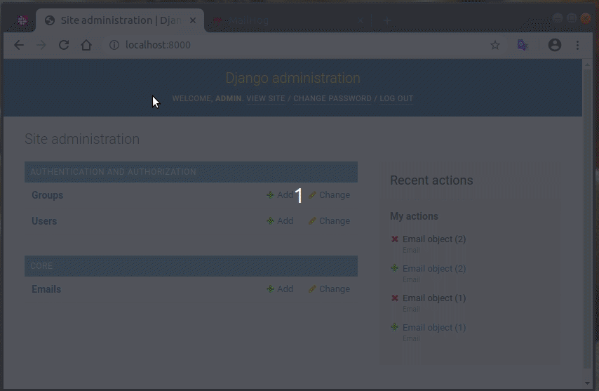

<h1 align="center">
  
</h1>

<h3 align="center">
  :email: Asynchronous email sending with Celery
</h3>

## Description
Simple django-admin dashboard to send asynchronous emails with Celery and Redis.

### Result
<h1 align="center">
  
</h1>

### Technologies
* Django
* Celery
* Redis (Message Broker)
* MailHog (SMTP testing server)

### Running

#### Dependencies
* docker
* docker-compose (pip install docker-compose)


```
$ docker-compose up
```
Open `localhost:8000` in your browser. It will open django-admin. You will need to create a superuser.

```
docker exec -it email_sending_web_1 bash
python manage.py createsuperuser
# set user and password
exit
```

Try to send an email and see the results on MailHog (`localhost:8025`)

If any problem happens during migrations, run: `docker-compose run migration`

### Running without docker
```
git clone && cd ..
docker run -it -p 5432:5432 -e POSTGRES_HOST_AUTH_METHOD=trust postgres
./manage.py migrate
./manage.py createsuperuser
docker run -it -p 6379:6379 redis
docker run -it -p 1025:1025 -p 8025:8025 mailhog/mailhog
./manage.py runserver
celery -A core worker -l info
```
